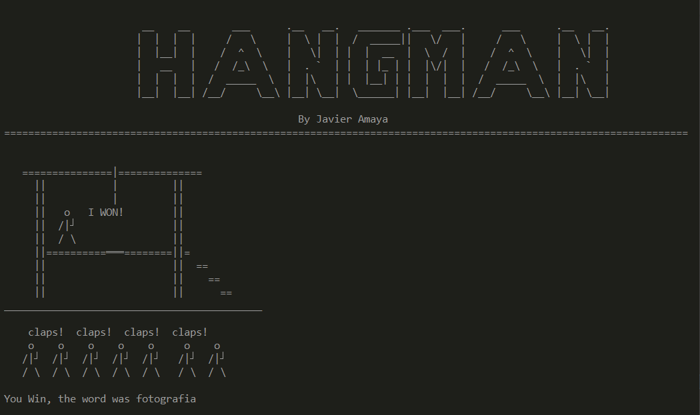

# 🎮 Hangman Game 🎮

Development of the Hangman game, creating by console using ASCII code to draw each scenario and putting into practice the knowledge acquired in Python.

I invite you to check my ASCII art created for this game in this [📑ASCII Hangman Art Gist 🕹️](http://gist.github.com/javieramayapat/76a5d33b59b8b5fc58389790932faa22 "see my own ascii hangman art here ")

Finally leave me a ⭐ and a comment 📝 with your opinion so we can continue improving them together.


 



## 🕹️ Previous configuration

First clone the proyect in your machine using
```
git clone https://github.com/javieramayapat/hangman-game.git
```
Then step into the folder hangman using the command 
```
cd hangman-hame
```
Lastly run the program with this command and enjoy the game
```
py main.py
```
